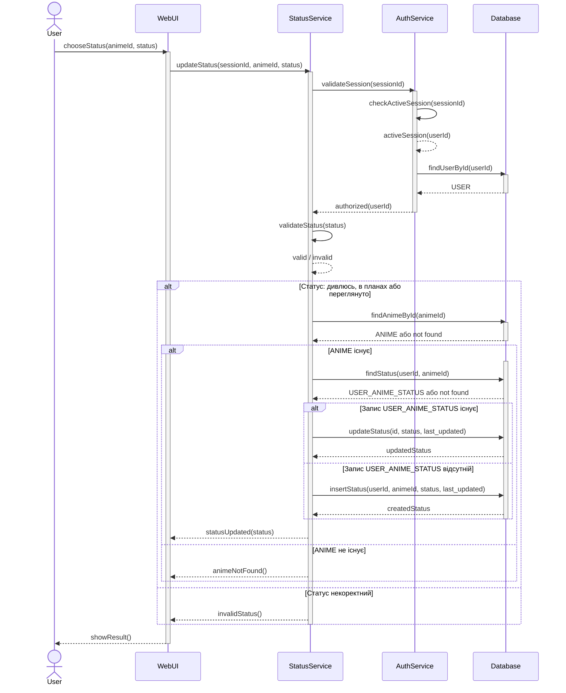
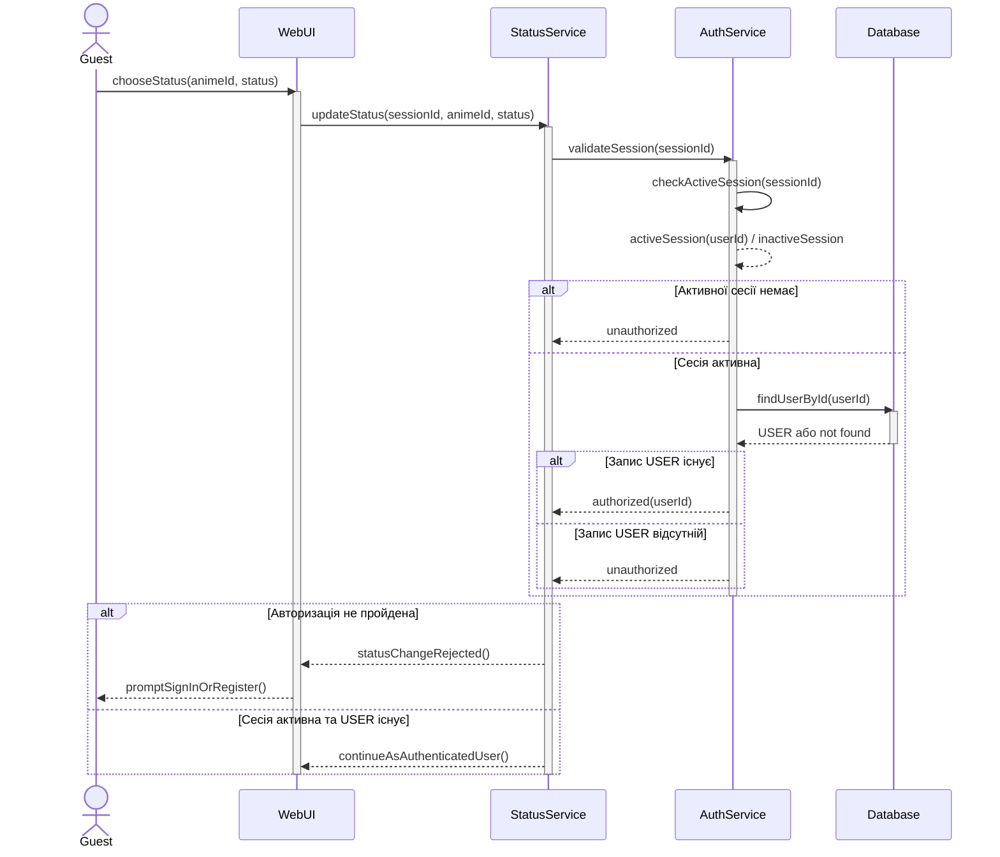

# Sequence-діаграми UC-2: Оновити статус перегляду

## Сценарій 1: Зареєстрований користувач задає статус аніме

```mermaid
sequenceDiagram
    actor User
    participant WebUI
    participant StatusService
    participant AuthService
    participant Database

    User->>WebUI: chooseStatus(animeId, status)
    activate WebUI
    WebUI->>StatusService: updateStatus(sessionId, animeId, status)
    activate StatusService
    StatusService->>AuthService: validateSession(sessionId)
    activate AuthService
    AuthService->>AuthService: checkActiveSession(sessionId)
    AuthService-->>AuthService: activeSession(userId)
    AuthService->>Database: findUserById(userId)
    activate Database
    Database-->>AuthService: USER
    deactivate Database
    AuthService-->>StatusService: authorized(userId)
    deactivate AuthService

    StatusService->>StatusService: validateStatus(status)
    StatusService-->>StatusService: valid / invalid
    alt Статус: дивлюсь, в планах або переглянуто
        StatusService->>Database: findAnimeById(animeId)
        activate Database
        Database-->>StatusService: ANIME або not found
        deactivate Database
        alt ANIME існує
            activate Database
            StatusService->>Database: findStatus(userId, animeId)
            Database-->>StatusService: USER_ANIME_STATUS або not found
            alt Запис USER_ANIME_STATUS існує
                StatusService->>Database: updateStatus(id, status, last_updated)
                Database-->>StatusService: updatedStatus
            else Запис USER_ANIME_STATUS відсутній
                StatusService->>Database: insertStatus(userId, animeId, status, last_updated)
                Database-->>StatusService: createdStatus
            end
            deactivate Database
            StatusService-->>WebUI: statusUpdated(status)
        else ANIME не існує
            StatusService-->>WebUI: animeNotFound()
        end
    else Статус некоректний
        StatusService-->>WebUI: invalidStatus()
    end
    deactivate StatusService
    WebUI-->>User: showResult()
    deactivate WebUI
```

## Сценарій 2: Гість намагається змінити статус перегляду

```mermaid
sequenceDiagram
    actor Guest
    participant WebUI
    participant StatusService
    participant AuthService
    participant Database

    Guest->>WebUI: chooseStatus(animeId, status)
    activate WebUI
    WebUI->>StatusService: updateStatus(sessionId, animeId, status)
    activate StatusService
    StatusService->>AuthService: validateSession(sessionId)
    activate AuthService
    AuthService->>AuthService: checkActiveSession(sessionId)
    AuthService-->>AuthService: activeSession(userId) / inactiveSession
    alt Активної сесії немає
        AuthService-->>StatusService: unauthorized
    else Сесія активна
        AuthService->>Database: findUserById(userId)
        activate Database
        Database-->>AuthService: USER або not found
        deactivate Database
        alt Запис USER існує
            AuthService-->>StatusService: authorized(userId)
        else Запис USER відсутній
            AuthService-->>StatusService: unauthorized
        end
    end
    deactivate AuthService

    alt Авторизація не пройдена
        StatusService-->>WebUI: statusChangeRejected()
        WebUI-->>Guest: promptSignInOrRegister()
    else Сесія активна та USER існує
        StatusService-->>WebUI: continueAsAuthenticatedUser()
    end
    deactivate StatusService
    deactivate WebUI
```
