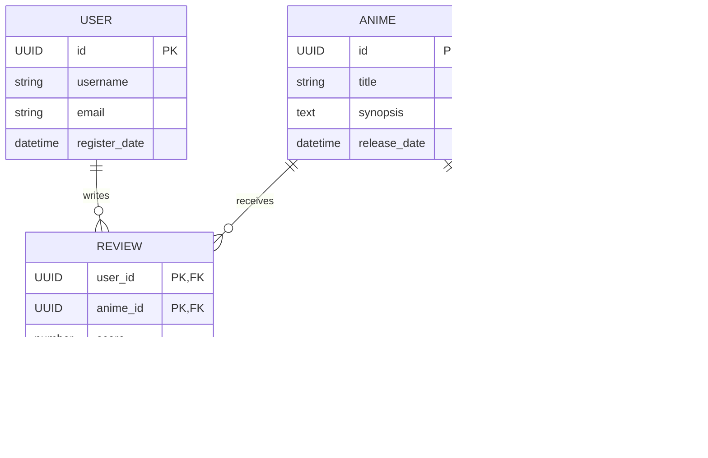

```mermaid
erDiagram
    USER {
        UUID id PK
        string username
        string email
        datetime register_date
    }

    ANIME {
        UUID id PK
        string title
        text synopsis
        datetime release_date
    }

    REVIEW {
        UUID user_id PK, FK
        UUID anime_id PK, FK
        number score
        text text
        string user_email
        datetime created_at
    }

    GENRE {
        UUID id PK
        string name
    }

    ANIME_GENRES {
        UUID anime_id PK, FK
        UUID genre_id PK, FK
    }

    USER ||--o{ REVIEW : writes
    ANIME ||--o{ REVIEW : receives
    ANIME ||--o{ ANIME_GENRES : contains
    GENRE ||--o{ ANIME_GENRES : belongs_to
```
