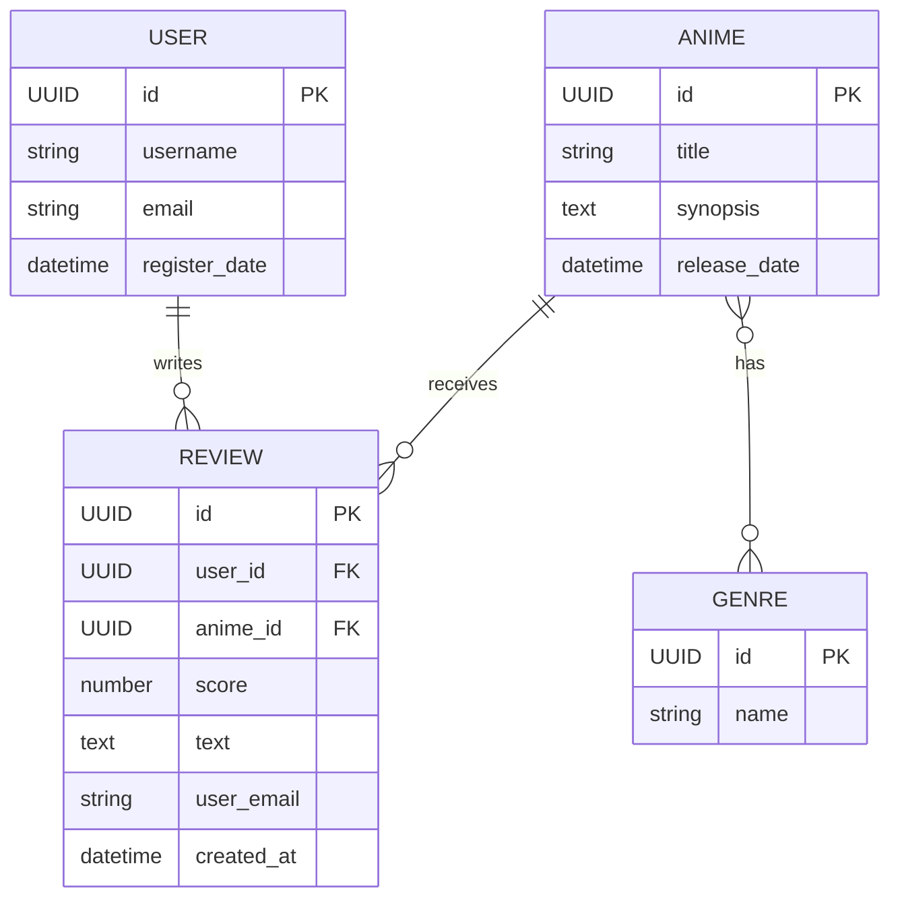

```mermaid
erDiagram
    USER {
        UUID id PK
        string username
        string email
        datetime register_date
    }

    ANIME {
        UUID id PK
        string title
        text synopsis
        datetime release_date
    }

    REVIEW {
        UUID id PK
        UUID user_id FK
        UUID anime_id FK
        number score
        text text
        string user_email
        datetime created_at
    }

    GENRE {
        UUID id PK
        string name
    }

    USER ||--o{ REVIEW : writes
    ANIME ||--o{ REVIEW : receives
    ANIME }o--o{ GENRE : has
```
